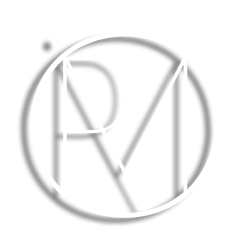

<h1 align="left" id="ms-title">:wave: Hello, I'm Mario Senese.</h1>
<h3 align="left">I am currently a Web Developer and I am Italian</h3>

  

- :ear_with_hearing_aid: &nbsp;I'm Deaf but I Hear and I Speak
- :writing_hand: &nbsp;My personal website is **[link]**
- :computer: &nbsp;Connect with me on **[LinkedIn]**
- :framed_picture: &nbsp;Follow me on **[Instagram]**

Mario Senese (he/they) is currently a web developer italian. He comes from a town in the province of Salerno, southern Italy. Mario has worked for ethanks s.r.l., Ricambi auto SMC and Caffeina Spa, as a web developer. He is a curious person. He loves learning, traveling, reading, sports and board games.

😄 Pronouns: He/Him/They/Them

[linkedin]: https://www.linkedin.com/in/mario-senese/ "LinkedIn"
[instagram]: https://www.instagram.com/senese.mario/ "Instagram"
[tiktok]: https://www.tiktok.com/@joekarlsson "Instagram"
[link]: https://mariosenese.github.io/ "Mario Senese"
